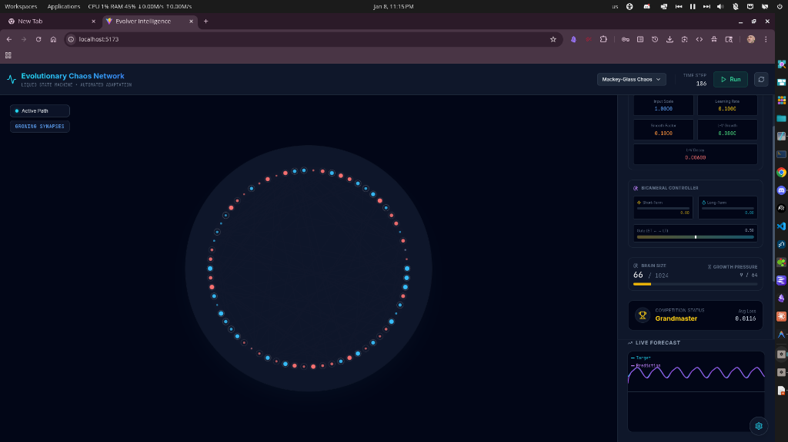

# Evolver-NN 🧠⚡

**A Self-Evolving Reservoir Computer with Lotka-Volterra Dynamics**

> An evolutionary neural network that grows, prunes, and adapts in real-time—inspired by biological neurogenesis, ecological population dynamics, and Dale's Law.




## ✨ What It Does

Watch a neural network **evolve from 64 neurons to 100+**, learning to predict the chaotic Mackey-Glass time series in real-time. The network:

- **Grows neurons** when learning stagnates
- **Prunes weak synapses** via Lotka-Volterra competition dynamics
- **Maintains E-I balance** (80% excitatory, 20% inhibitory) following Dale's Law
- **Self-tunes hyperparameters** via a bicameral meta-controller

**Typical performance:** Reaches **Grandmaster** (loss < 0.02) within 30 seconds, achieving **< 0.01 MSE** on Mackey-Glass prediction.

---

## 🔬 Core Architecture

```
┌─────────────────────────────────────────────────────────────┐
│                    Bicameral Meta-Controller                │
│              (Short-Term + Long-Term + Gate)                │
├─────────────────────────────────────────────────────────────┤
│     ┌─────────┐      ┌─────────────────┐      ┌─────────┐  │
│     │  Input  │ ───► │    Reservoir    │ ───► │ Readout │  │
│     │ Weights │      │  (N neurons)    │      │ Weights │  │
│     └─────────┘      └─────────────────┘      └─────────┘  │
│           ▲                   │                     │       │
│           │                   ▼                     │       │
│   L-V Growth ◄── Lotka-Volterra Dynamics ──► L-V Pruning   │
└─────────────────────────────────────────────────────────────┘
```

### Key Components

| Component              | Description                                                                    |
| ---------------------- | ------------------------------------------------------------------------------ |
| **Reservoir**          | Leaky-integrate-and-fire neurons with fixed random recurrent weights           |
| **Dale's Law**         | 80% excitatory (+) and 20% inhibitory (−) neurons with strict sign constraints |
| **Sinkhorn Stability** | Doubly-stochastic normalization prevents spectral explosion                    |
| **L-V Dynamics**       | Weights compete like populations—strong survive, weak die                      |
| **Lateral Inhibition** | Local competition (5-neighbor kernel) forces feature organization              |
| **Metabolic Energy**   | Per-neuron energy tracking for activity-based adaptation                       |
| **Winter Events**      | Periodic pruning pressure (3x decay) forces robust sparsity                    |

---

## 🚀 Quick Start

```bash
# Clone and install
git clone https://github.com/angrysky56/evolver-nn.git
cd evolver-nn
npm install

# Run development server
npm run dev
# Open http://localhost:5173

# Build for production
npm run build
```

---

## 📊 Live Visualization

The UI shows real-time:

- **Network topology** (neurons as nodes, E/I connections as red/blue edges)
- **Rank progression** (Novice → Apprentice → Adept → Master → Grandmaster → Solved)
- **Waveform** of prediction vs target (Mackey-Glass chaotic time series)
- **Meta-controller** activity (Short-term, Long-term, Gate blend)
- **L-V Dynamics** (active synapses, plasticity events, dynamic targets)

---

## 🔧 Configuration

Key parameters in `src/engine/simulationEngine.ts`:

```typescript
const DEFAULT_CONFIG = {
  maxNeurons: 1024, // Growth ceiling
  initialNeurons: 64, // Start size
  learningRate: 0.1, // Readout learning rate
  pruneThreshold: 0.01, // Below this magnitude = prune
  patienceLimit: 64, // Steps of stagnation before neurogenesis
  lvGrowth: 0.08, // L-V growth pressure
  lvDecay: 0.006, // L-V decay/competition pressure
}
```

---

## 📚 Inspirations

| Paper                                                                                               | Key Insight                                  | How We Use It                |
| --------------------------------------------------------------------------------------------------- | -------------------------------------------- | ---------------------------- |
| [**Echo State Networks**](https://www.ai.rug.nl/minds/uploads/EchoStatesTechRep.pdf) (Jaeger, 2001) | Fixed random reservoir + trained readout     | Core architecture            |
| [**DiscoRL**](https://www.nature.com/articles/s41586-025-09761-x) (Nature, 2025)                    | Meta-network discovers RL update rules       | Bicameral meta-controller    |
| [**mHC**](https://arxiv.org/abs/2512.24880)                                                         | Doubly stochastic matrices prevent explosion | Sinkhorn-Knopp normalization |
| [**BrainCraft**](https://github.com/rougier/braincraft) (Rougier, 2025)                             | Embodied neural agent benchmark              | Future integration target    |
| [**Lotka-Volterra**](https://en.wikipedia.org/wiki/Lotka%E2%80%93Volterra_equations)                | Predator-prey population dynamics            | Synaptic competition model   |

---

## 🗺️ Roadmap

- [x] Core reservoir with online learning
- [x] Neurogenesis and synaptic pruning
- [x] Dale's Law (E-I balance)
- [x] Sinkhorn-Knopp spectral stability
- [x] Lotka-Volterra weight dynamics
- [x] Bicameral meta-controller
- [x] Grandmaster performance on Mackey-Glass
- [ ] BrainCraft integration
- [ ] Multi-task curriculum

---

## 🤝 Contributing

PRs welcome! Especially interested in:

- Novel plasticity rules
- Stability mechanisms
- BrainCraft task implementations
- UI/visualization improvements

---

## 📜 License

MIT License - see [LICENSE](LICENSE)

---

_Built with 🧬 by evolving neurons_

Tyler B. Hall, Claude Opus 4.5, and Gemini 3 Pro
