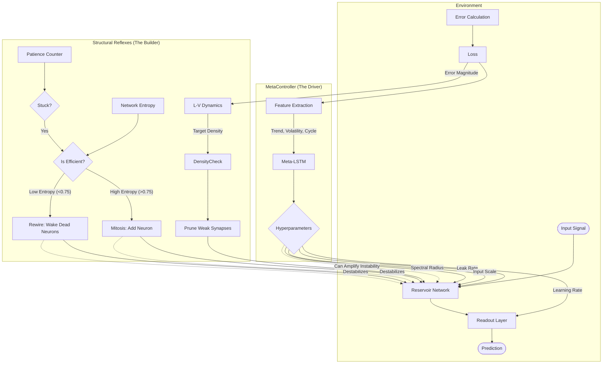

# Evolver-NN System Architecture

This document maps the dynamics of the "Liquid State Machine" ecosystem. It visualizes how the three independent control loops interact (and potentially conflict).

## The Core Triad

The system is composed of three "agents" effectively fighting for control:

1.  **The Reservoir (Physics):** The actual neural network computing predictions.
2.  **The MetaController (The Driver):** An LSTM that observes error trends and tunes hyperparameters (Gas/Brake/Steering).
3.  **The Structural Reflexes (The Engineer/Builder):** Hard-coded logic that adds/removes neurons based on entropy and starvation.

## Potential Conflict Zones (The "Explosions")

1.  **Driver vs. Mechanic Conflict:**
    *   **Scenario:** The Driver (MetaController) learns that "High Spectral Radius" is good for the current network.
    *   **Event:** The Mechanic (Rewire) suddenly changes the network topology.
    *   **Result:** The "High Spectral Radius" is now TOXIC for the new topology, causing an explosion before the Driver can react.

2.  **The "Hammering" Loop:**
    *   **Scenario:** Network stagnates.
    *   **Event:** Structure adds a neuron (Mitosis).
    *   **Result:** Loss momentarily spikes due to the new neuron.
    *   **Bad Reaction:** If the Driver panics and cranks up the Learning Rate during the spike, it causes chaos.

3.  **Entropy Trap:**
    *   **Scenario:** Entropy is low (dead neurons).
    *   **Action:** Driver increases "Regularization" to force diversity.
    *   **Conflict:** Mechanic simultaneously Prunes the weak connections.
    *   **Result:** The "weak" connections that were trying to grow are cut off by the Driver or Pruner.

## Current Safeguards (Implemented)

*   **Structural Cooldown:** Prevents Mechanic from acting too often (e.g., waiting 500 steps after Mitosis).
*   **Normalized Pruning:** Ensures pruning doesn't artificially inflate the energy of remaining synapses.
*   **Unlock Threshold:** Allows the Driver to resume learning if the Mechanic breaks something (loss increases).
